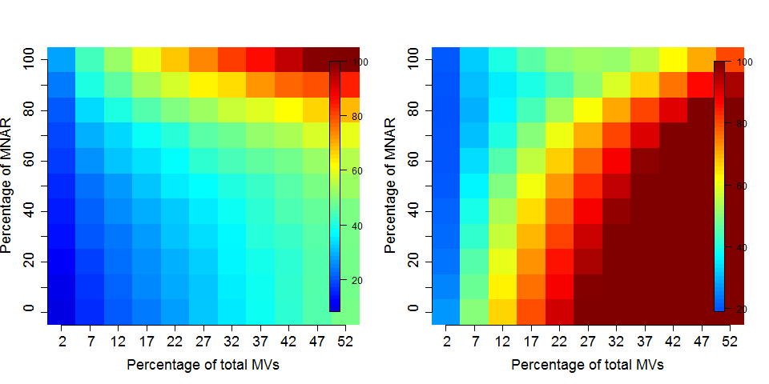

# Quantitative data {#sec:quant}


There are a wide range of proteomics quantitation techniques that can
broadly be classified as labelled vs. label-free, depending whether
the features are labelled prior the MS acquisition and the MS level at
which quantitation is inferred, namely MS1 or MS2.

```{r quanttab, echo=FALSE, results='asis'}
qtb <- matrix(c("XIC", "Counting", "SILAC, 15N", "iTRAQ, TMT"),
              nrow = 2, ncol = 2)
dimnames(qtb) <- list(
    'MS level' = c("MS1", "MS2"),
    'Quantitation' = c("Label-free", "Labelled"))

knitr::kable(qtb)
```

In terms of raw data quantitation, most efforts have been devoted to
MS2-level quantitation. Label-free XIC quantitation has however been
addressed in the frame of metabolomics data processing by the
`r Biocpkg("xcms")` infrastructure.

Below is a list of suggested packages for some common proteomics
quantitation technologies:

* Isobaric tagging (iTRAQ and TMT): `r Biocpkg("MSnbase")` and `r Biocpkg("isobar")`.
* Label-free: `r Biocpkg("xcms")` (metabolomics).
* Counting: `r Biocpkg("MSnbase")` and `r Biocpkg("MSnID")` for
  peptide-spectrum matching confidence assessment.
* `r Githubpkg("vladpetyuk/N14N15")` for heavy Nitrogen-labelled data.

## The `MSnSet` class for quantitative data

Quantitative data is stored in a dedicated data structure called
`MSnSet`. The figure below gives a schematics of an `MSnSet` instance
and the relation between the assay data and the respective feature and
sample metadata, accessible respectively with the `exprs`, `fData` and
`pData` functions.


Storing quantitative data in an `MSnSet` quaranties that the feature
(peptides or proteins) and sample annotations are correctly aligned
with the quantitative data, i.e.

- there is a one-to-one match between the expression data rows and
  feature meta data rows;
- there is a one-to-one match between the expression data columns and
  sample meta data rows.

This correspondance is also guaranteed during all data processing and
manipulation.


## Isobaric tagging

An `MSnExp` is converted to an `MSnSet` by the `quantitation`
method. Below, we use the iTRAQ 4-plex isobaric tagging strategy
(defined by the `iTRAQ4` parameter; other tags are available: see
`?ReporterIons`) and the `max` method to calculate the use the maximum
of the reporter peak for quantitation.

```{r itraq4plot, fig.cap = "MS2 spectrum and it's iTRAQ4 reporter ions."}
plot(msexp[[1]], full=TRUE, reporters = iTRAQ4)
```

```{r quantitraq}
msset <- quantify(msexp, method = "max", reporters = iTRAQ4)
```

Below, we access the quantitative and metadata slots of the newly
created `MSnSet` object.


```{r msnsetslots1}
exprs(msset)
head(fData(msset))
pData(msset)
```

New columns can be added to the metadata slots.


```{r msnsetslots2}
pData(msset)$groups <- rep(c("Treat", "Cond"), each = 2)
pData(msset)
```

Another useful slot is `processingData`, accessed with
`processingData(.)`, that records all the processing that objects have
undergone since their creation.


```{r msnsetslots3}
processingData(msset)
```

## Spectral counting

Other MS2 quantitation methods available in `quantify` include the
(normalised) spectral index `SI` and (normalised) spectral abundance
factor `SAF` or simply a simple count
method^[The code below is for illustration only - it doesn't make much sense to perform any of these quantitations on such a multiplexed data].

```{r lfms2}
exprs(si <- quantify(msexp, method = "SIn"))
exprs(saf <- quantify(msexp, method = "NSAF"))
```

Note that spectra that have not been assigned any peptide (`NA`) or
that match non-unique peptides (`npsm > 1`) are discarded in the
counting process.


As shown above, the `r Biocpkg("MSnID")` package enables to explore
and assess the confidence of identification data using `mzid` files. A
subset of all peptide-spectrum matches, that pass a specific false
discovery rate threshold can them be converted to an `MSnSet`, where
the number of peptide occurrences are used to populate the assay data.

## Importing third-party quantitation data

### From `MzTab` files {-}

<div class="boxed yellow">On-line</div>

The Proteomics Standard Initiative (PSI) `mzTab` file format is aimed
at providing a simpler (than XML formats) and more accessible file
format to the wider community. It is composed of a key-value metadata
section and peptide/protein/small molecule tabular sections. These
data can be imported with the `readMzTabData`
function^[We specify version 0.9 (which generates the warning) to fit with the version of that file. For recent files, the `version` argument should be ignored to use the importer for the current file version 1.0.].


```{r mztab, eval = FALSE}
mztf <- pxget(px, "F063721.dat-mztab.txt")
(mzt <- readMzTabData(mztf, what = "PEP", version = "0.9"))
```

### From spreadsheets {-}

It is also possible to import arbitrary spreadsheets (such as those
exported by MaxQuant, ProteomeDiscoverer, ...) as `MSnSet` objects
into R with the `readMSnSet2` function. The main 2 arguments of the
function are (1) a text-based spreadsheet and (2) column names of
indices that identify the quantitation data. The latter can be queried
with the `getEcols` function.

```{r readmsnset2}
csv <- dir(system.file ("extdata" , package = "pRolocdata"),
           full.names = TRUE, pattern = "pr800866n_si_004-rep1.csv")
getEcols(csv, split = ",")
ecols <- 7:10
res <- readMSnSet2(csv, ecols)
head(exprs(res))
head(fData(res))
```

However, as we see below, we do not have any metadata about samples,
i.e. about the design of the experiment.

```{r respd}
pData(res)
```

This can be done manually, or by importing a csv file containing that
design. Below, we define two groups and two operators for the 4
samples of the `res` object created above:

```{r}
pData(res)$group <- rep(c("A", "B"), each = 2)
pData(res)$operator <- rep(1:2, 2)
pData(res)
```

Note that `pData(res)$` can be shortened with `res$`. This is also
valid when setting new metadata, as shown above.

```{r}
pData(res)$group
res$group
```

### Exercise {-}

Using `readMSnSet2`, load the following file that was part of the
supplementary information of a manuscript.

```{r pdfile}
csvfile <- dir(system.file("extdata", package = "pRolocdata"),
               pattern = "hyperLOPIT-SIData-ms3-rep12-intersect.csv",
               full.names = TRUE)
basename(csvfile)
```

You'll first need to identify which columns to use as expression
data. In this case however, two rows are used as header, and you'll
need to set `n` in `getEcols` to retrieve the appropriate one. There
are 20 expresion columns annotated as TMT 10 plex reporter ion M/Z
values (if you don't know these, you can find them out by looking at
the `TMT10` reporter ion object). You can now use `readMSnSet2`,
remembering to skip 1 line and, optionally, use the first column as
feature names (see the `fnames` argument). What are the number of
features and samples in the data?


<details>
```{r solreadmsnset}
getEcols(csvfile, split = ",", n = 2)
msn <- readMSnSet2(csvfile, ecol = 8:27, fnames = 1, skip = 1)
dim(msn)
```
</details>

### Exercise {-}

Add the following experimental design to the `MSnSet` created
above. The 10 first samples originate from batch A, and the 10
following from batch B. Sameple 1 to 5 and 11 to 15 belong to the
control group, and the others to the condition group. Even samples are
female and odd samples are male.

<details>
```{r solreadmsnset2}
msn$batch <- rep(c("A", "B"), each = 10)
msn$group <- rep(rep(c("CTRL", "COND"), each = 5), 2)
msn$gender <- rep(c("M", "F"), 10)
pData(msn)
```
</details>


## Data processing

We are going to use the `cptac_a_b_peptides.txt` tab-separated file
from the `msdata` package. These data are the 6th study of the
Clinical Proteomic Technology Assessment for Cancer (CPTAC). In this
experiment, the authors spiked the Sigma Universal Protein Standard
mixture 1 (UPS1) containing 48 different human proteins in a protein
background of 60 ng/μL Saccharomyces cerevisiae strain BY4741 . Two
different spike-in concentrations were used: 6A (0.25 fmol UPS1
proteins/μL) and 6B (0.74 fmol UPS1 proteins/μL). We limited ourselves
to the data of LTQ-Orbitrap W at site 56. The data were searched with
MaxQuant version 1.5.2.8, and detailed search settings were described
in [Goeminne *et al.*
(2016)](https://www.ncbi.nlm.nih.gov/pubmed/26566788). Three
replicates are available for each concentration. The study is a
spike-in study for which we know the ground truth so we have the
ability to evaluate the quality of the fold change estimates and the
list of DE genes that we return with a method.


```{r cptacfile}
basename(f <- msdata::quant(full.names = TRUE))
```

Before reading the spreadsheet, we need to identify which columns
contain quantitation data (that will be used to populate the `exprs`
slot) and the feature data (that will be put into the `fData` slot).

The `getEcols` function lists the column names in the expression data
spreadsheet. The quantitative values we want to used are those in the
columns starting with`Intensity 6A_7`, `Intensity 6A_8`, ... 
`Intensity 6B_9`, that we refer to with `Intensity `. 


```{r read0}
getEcols(f, split = "\t")
```

Using a pattern, we can set the columns to be used to populate the
quantitation slot.


```{r read}
(e <- grepEcols(f, "Intensity ", split = "\t")) ## careful at the space!
(cptac <- readMSnSet2(f, ecol = e,
                      fnames = "Sequence",
                      sep = "\t"))
```


We can access the peptide-level expression data with `exprs` and the
feature meta-data with `fData`.

```{r exprs_and_fData}
head(exprs(cptac))
tail(exprs(cptac))
fvarLabels(cptac)
```

For the sake of simplicity, we can clean up the feature variables and
only keep those of interest. It is possible to do this interactively
with

```{r selectfeats0, eval = FALSE}
cptac <- selectFeatureData(cptac)
```

or by setting the feature variables of interest.

```{r selectfeats}
cptac <- selectFeatureData(cptac,
                           fcol = c("Proteins",
                                    "Potential.contaminant",
                                    "Reverse",
                                    "Sequence"))
fvarLabels(cptac)
```

Let's also add sample annotations:

```{r pdata}
cptac$condition <- factor(rep(c("A", "B"), each = 3))
cptac$sample <- rep(7:9, 2)
pData(cptac)
```

This could also be done by reading a spreadsheet into R as a
`data.frame`, making sure that the rownames match the sample names
exactly, and then adding it with `pData(cptac) <- myDf`.


The sample names are rather long and contain information on the
spike-in concentration and the repeat. We this remove `Intensity.6`
from the sample names:

```{r snms}
sampleNames(cptac) <- sub("Intensity\\.6", "", sampleNames(cptac))
sampleNames(cptac) 
```


## Handling overlapping protein groups

In our approach a peptide can map to multiple proteins, as long as
there is none of these proteins present in a smaller subgroup.

The `smallestUniqueGroups` function stems from the `MSqRob` package,
that can be installed with:

```{r, eval = FALSE}
BiocManager::install("statOmics/MSqRob")
```

```{r smugr0}
head(keep <- MSqRob::smallestUniqueGroups(fData(cptac)$Proteins))
length(keep)
length(unique(fData(cptac)$Proteins))
```

As shown above, we will keep `r length(keep)` protein groups
from the `r length(unique(fData(cptac)$Proteins))` 
protein groups recorded in the data. This vector of protein names is
used to filter the peptide-level data.

```{r smugr1}
(cptac <- cptac[fData(cptac)$Proteins %in% keep, ])
```

### Exercise {-}

How many peptides have we lost by removing the proteins above?

## Filtering out contaminants and reverse hits

Below, we create vector of logicals (and count) recording peptides
that are assigned to contaminant (such as keratine, trypsine, ...) and
reverse proteins (from the decoy database). These are annotated with a
`"+"` in the respective `"Potential.contaminant"` and `"Reverse"`
feature variables.


```{r conts}
table(sel_conts <- fData(cptac)$Potential.contaminant != "+")
```

```{r rev}
table(sel_rev <- fData(cptac)$Reverse != "+")
```

```{r filtering}
(cptac <- cptac[sel_conts & sel_rev, ])
```

You can keep track of the data processing steps in the object's
processing log.

## Removing PTM-only proteins

Proteins for which all peptides are carrying modifications (PTMs) can
be considered as unreliable. We will filter out these proteins. This
information is included in the `Only.identified.by.site` column of the
`proteinGroups.txt` MaxQuant file. The code chunk below provides this
list of proteins.

```{r ptm_only}
ptm_only <- c("REV__CON__Q3T052", "REV__sp|P01120|RAS2_YEAST",
              "REV__sp|P32849|RAD5_YEAST",
              "REV__sp|Q03723|OST6_YEAST", "sp|P04051|RPC1_YEAST",
              "sp|P06367|RS14A_YEAST",
              "sp|P0CX73|YP11A_YEAST;sp|P0CX72|YL12A_YEAST;sp|P0CX71|YE11A_YEAST;sp|P0CX70|YD15A_YEAST;sp|Q6Q5H1|YP14A_YEAST;sp|P0C2I8|YL14A_YEAST",
              "sp|P19657|PMA2_YEAST", "sp|P32465|HXT1_YEAST",
              "sp|P39567|IMDH1_YEAST", "sp|P40527|ATC7_YEAST",
              "sp|P40530|PDK1_YEAST", "sp|P40989|FKS2_YEAST",
              "sp|P49955|SF3B1_YEAST", "sp|P51401|RL9B_YEAST",
              "sp|P53072|TAN1_YEAST", "sp|Q03964|YD17A_YEAST",
              "sp|Q04670|YM14B_YEAST;sp|Q12088|YL11B_YEAST;sp|Q03619|YE12B_YEAST",
              "sp|Q08649|ESA1_YEAST", "sp|Q12112|YN11B_YEAST",
              "sp|Q12479|IRC11_YEAST", "sp|Q3E7B7|YD85C_YEAST")
```

We now remove the peptides matched to these proteins:

```{r ptm_only_remove}
(cptac <- cptac[!fData(cptac)$Proteins %in% ptm_only, ])
```

## Missing values

Unfortunately, some software use 0 irrespective whether the data has
intensity zero and when the data haven't been observer. Below we fix
this by setting all 0 values to `NA`.


```{r setna}
exprs(cptac)[exprs(cptac) == 0] <- NA
table(is.na(exprs(cptac)))
```

The following figure shows the distribution of missing values for
samples (columns) and rows (peptides). The cells have been reporder to
emphasis the presence of missing values in the proteins shown at the
top and the samples shown towards the right.

```{r napac, fig.cap = "Overview of missing data"}
naplot(cptac, col = c("black", "white"))
```

The following figure the proportions of features (peptides in this
case) with respect to their completeness (blue) and the percentage of
missing data in the full dataset (red).

```{r plotNA, fig.cap = "Data completeness."}
plotNA(cptac)
```

Below, we count the number of missing values in each 

```{r nna}
fData(cptac)$nNA <- apply(exprs(cptac), 1, function(x) sum(is.na(x)))
table(fData(cptac)$nNA)
```

Note that some peptides aren't seen at all because these 6 samples are
a subset of a larger dataset, and these features are present in the
other acquisitions only.

From here on one could:

- **filter** data with missing values, which however sacrifices a lot
  of data.

```{r filterNA}
filterNA(cptac)
```

- perform **imputation**, considering the underlying nature of
  missingness, i.e missing not at random (left-censored) or at
  random. See below.

- The best solution is arguably to handle missing values at **the
  statistical test level**, which is the approach we are going to use.

We are going to keep peptides that had a least two observations. This
can be done with the `nNA` variable that we compute above

```{r nNAfilt}
(cptac <- cptac[fData(cptac)$nNA <= 4, ])
```

## Log transformation

```{r log}
(cptac <- log(cptac, base = 2))
```

## Normalisation

Normalisation is handled by the `normalise` (or `normalize`) function.

```{r norm, message = FALSE}
library("limma")
plotDensities(exprs(cptac))
(cptac <- normalise(cptac, method = "quantiles"))
plotDensities(exprs(cptac))
```

We can visualise our peptide-level data using a Multi Dimensional
Scaling (MDS) plot, using the `plotMDS` function from the `limma`
package. We use the condition sample variable to colour-code the
samples.


```{r mds0}
plotMDS(exprs(cptac), col = as.numeric(cptac$condition))
```

The first axis in the plot is showing the leading log fold changes
(differences on the log scale) between the samples.  We notice that
the leading differences in the peptide data seems to be driven by
technical variability. Indeed the samples do not seem to be clearly
separated according to the spike in condition.

## Summarisation

So far we have used quantitation values at the peptide level, while
the data of interest are proteins. We can take all peptides that are
associated with a protein group, as defined by the `Proteins` feature
variable, and aggregate them using an summary function of choice.


```{r featsfig2, fig.cap = "Multiple levels of summarisation. Examples of aggregation from PSMs, peptides to proteins using median aggregation (from the [`Features`](https://rformassspectrometry.github.io/Features/articles/Features.html) package).", echo = FALSE}
knitr::include_graphics("./img/features.png")
```

Below, we combine the peptides into proteins using the median, passing
`na.rm = TRUE` to account for the missing values in the data. 

```{r combine_med}
(cptac_prot <- combineFeatures(cptac, fcol = "Proteins",
                               method = "median", na.rm = TRUE))
```

We obtain `r nrow(cptac_prot)` proteins. Note how the processing steps are recorded. Below, we
visualise the protein-level data on an MDS plot.


```{r mds1}
plotMDS(exprs(cptac_prot), col = as.numeric(cptac_prot$condition))
```

### Exercise {-}

Repeat the summarisation using a the robust normalisation by setting
`method = "robust"`, as described in [Sticker *et
al*. (2019)](https://www.biorxiv.org/content/10.1101/668863v1) and
visualise the data on an MDS plot. Which one do you anticipate to
provide better results?

<details>
```{r combine_rob, warning = FALSE}
cptac_rob <- combineFeatures(cptac, fcol = "Proteins",
                             method = "robust", na.rm = TRUE)
plotMDS(exprs(cptac_rob), col = as.numeric(cptac_rob$condition))
```
</details>


## More on missing values

Finally, proteomics data analysis is generally hampered by missing
values. Missing data imputation is a sensitive operation whose success
will be guided by many factors, such as degree and (non-)random nature
of the missingness.

Below, we load an `MSnSet` with missing values, count the number
missing and non-missing values.

```{r impute0}
data(naset)
table(is.na(naset))
```

The `naplot` figure will reorder cells within the data matrix so that
the experiments and features with many missing values will be grouped
towards the top and right of the heatmap, and barplots at the top and
right summarise the number of missing values in the respective samples
(column) and rows (rows).

```{r naplot, fig.cap = "Overview of missing values."}
naplot(naset)
```

The importance of missing values in a dataset will depend on the
quantitation technology employed. Label-free quantitation in
particular can suffer from a very high number of missing values.

Missing value in `MSnSet` instances can be filtered out with the
`filterNA` functions. By default, it removes features that contain at
least `NA` value.

```{r filterNA2}
## remove features with missing values
tmp <- filterNA(naset)
processingData(tmp)
```


It is of course possible to impute missing values (`?impute`). This is
however not a straightforward thing, as is likely to dramatically fail
when a high proportion of data is missing (10s of
%)^[Note that when using `r Biocpkg("limma")` for instance, downstream analyses can handle missing values. Still, it is recommended to explore missingness as part of the exploratory data analysis.]. But
also, there are two types of mechanisms resulting in missing values in
LC/MSMS experiments.

* Missing values resulting from absence of detection of a feature,
  despite ions being present at detectable concentrations.  For
  example in the case of ion suppression or as a result from the
  stochastic, data-dependent nature of the MS acquisition
  method. These missing value are expected to be randomly distributed
  in the data and are defined as **missing at random** (MAR) or
  **missing completely at random** (MCAR).

* Biologically relevant missing values, resulting from the *absence*
  or the low abundance of ions (below the limit of detection of the
  instrument). These missing values are not expected to be randomly
  distributed in the data and are defined as **missing not at random**
  (MNAR).

```{r naheatmap, echo=FALSE, fig.cap="Random and non-random missing values."}
x <- impute(naset, "zero")
exprs(x)[exprs(x) != 0] <- 1
gplots::heatmap.2(exprs(x), col = c("lightgray", "black"),
                  scale = "none", dendrogram = "none",
                  trace = "none", keysize = 0.5, key = FALSE,
                  RowSideColors = ifelse(fData(x)$randna, "orange", "brown"),
                  ColSideColors = rep(c("steelblue", "darkolivegreen"), each = 8))
```

Different imputation methods are more appropriate to different classes
of missing values (as documented in this
[paper](http://pubs.acs.org/doi/abs/10.1021/acs.jproteome.5b00981)). Values
missing at random, and those missing not at random should be imputed
with different methods.


```{r lazar, fig.cap = "Effect of the nature of missing values on their imputation. Root-mean-square error (RMSE) observations standard deviation ratio (RSR), KNN and MinDet imputation. Lower (blue) is better.", echo = FALSE, out.width='100%'}

```

See Lazar *et al.* [Accounting for the Multiple Natures of Missing
Values in Label-Free Quantitative Proteomics Data Sets to Compare
Imputation
Strategies](http://dx.doi.org/10.1021/acs.jproteome.5b00981).


Generally, it is recommended to use **hot deck** methods (nearest
neighbour (**left**), maximum likelihood, ...) when data are missing
at random.Conversely, MNAR features should ideally be imputed with a
**left-censor** (minimum value (**right**), but not zero, ...) method.


```{r impute}
## impute missing values using knn imputation
tmp <- impute(naset, method = "knn")
processingData(tmp)
```

There are various methods to perform data imputation, as described in
`?impute`. The `r CRANpkg("imp4p")` package contains additional
functionality, including some to estimate the randomness of missing
data.


### Exercise {-}

Following the example above, apply a mixed imputation, using knn for
data missing at random and the deterministic minumum left-cencored
imputation for data missing no at random.


<details>
```{r naex1, message = FALSE}
impute(naset, "mixed",
       randna = fData(naset)$randna,
       mar = "knn", mnar = "MinDet")
```
</details>

### Exercise {-}

When assessing missing data imputation methods, such as in [Lazar et
al. (2016)](https://pubs.acs.org/doi/abs/10.1021/acs.jproteome.5b00981),
one often replaces values with missing data, imputes these with a
method of choice, then quantifies the difference between original
(expected) and observed (imputed) values. Here, using the `naset`
data, use this strategy to assess the difference between knn and
Bayesian PCA imputation.

<details>
```{r naex2, cache = TRUE}
imp1 <- impute(naset, method = "knn")
imp2 <- impute(naset, method = "bpca")
summary(abs(exprs(imp1)[is.na(naset)] - exprs(imp2)[is.na(naset)]))
summary(as.numeric(na.omit(exprs(naset))))
```
</details>

### Exercise {-}

When assessing the impact of missing value imputation on real data,
one can't use the strategy above. Another useful approach is to assess
the impact of the imputation method on the distribution of the
quantitative data. For instance, here is the intensity distribution of
the `naset` data. Verify the effect of applying `knn`, `zero`,
`MinDet` and `bpca` on this distribution.

```{r nasetdist, fig.cap = "Intensity disctribution of the `naset` data."}
plot(density(na.omit(exprs(naset))))
```

<details>
```{r naex3, cache = TRUE}
cls <- c("black", "red", "blue", "steelblue", "orange")
plot(density(na.omit(exprs(naset))), col = cls[1])
lines(density(exprs(impute(naset, method = "knn"))), col = cls[2])
lines(density(exprs(impute(naset, method = "zero"))), col = cls[3])
lines(density(exprs(impute(naset, method = "MinDet"))), col = cls[4])
lines(density(exprs(impute(naset, method = "bpca"))), col = cls[5])
legend("topright", legend = c("orig", "knn", "zero", "MinDet", "bpca"),
       col = cls, lwd = 2, bty = "n")
```
</details>


## Differential expression

R in general and Bioconductor in particular are well suited for the
statistical analysis of data of quantitative proteomics data. Several
packages provide dedicated resources for proteomics data:

- `r Biocpkg("MSstats")` and `r Biocpkg("MSstatsTMT")`: A set of tools
  for statistical relative protein significanceanalysis in Data dependent
  (DDA), SRM, Data independent acquisition (DIA) and TMT experiments.

- `r Biocpkg("msmsTests")`: Statistical tests for label-free LC-MS/MS
  data by spectral counts, to discover differentially expressed
  proteins between two biological conditions. Three tests are
  available: Poisson GLM regression, quasi-likelihood GLM regression,
  and the negative binomial of the `r Biocpkg("edgeR")`
  package. All can be readily applied on `MSnSet` instances produced,
  for example by `MSnID`.

- `r Biocpkg("DEP")` provides an integrated analysis workflow for the
  analysis of mass spectrometry proteomics data for differential
  protein expression or differential enrichment.

- `r BiocStyle::Githubpkg("statOmics/MSqRob")`: The `MSqRob` package allows a user to do quantitative protein-level
  statistical inference on LC-MS proteomics data. More specifically,
  our package makes use of peptide-level input data, thus correcting
  for unbalancedness and peptide-specific biases. As previously shown
  ([Goeminne et
  al. (2015)](https://pubs.acs.org/doi/abs/10.1021/pr501223t)), this
  approach is both more sensitive and specific than summarizing
  peptide-level input to protein-level values. Model estimates are
  stabilized by ridge regression, empirical Bayes variance estimation
  and downweighing of outliers. Currently, only label-free proteomics
  data types are supported.

Others, while not specfic to proteomics, are also recommended, such as
the `r Biocpkg("limma")` package. When analysing spectral counting
data, methods for high throughput sequencing data are
applicable. Below, we illustrate how to apply a typical `edgeR` test
to count data using the `msms.edgeR` function from the `msmsTests`
package.


### `t.test`


We can start with a simpe t-test comparing the expression of the first
protein for groups A and B.

```{r}
pData(cptac_rob)
tt1 <- t.test(exprs(cptac_rob)[1, 1:3],
              exprs(cptac_rob)[1, 4:6])
tt1$p.value
```

This approach can be applied on each protein (row) of our dataset by
writing a simple helper function. This will however fail if we don't
have at least 2 expression values per group. We thus also apply an
additional filter to remove features with `NA` values (this could be
refined, but see below).

```{r}
my_t_test <- function(prot_i) 
    t.test(prot_i[1:3], prot_i[4:6])$p.value


cptac_rob_2 <- filterNA(cptac_rob)                     
pv <- apply(exprs(cptac_rob_2), 1, my_t_test)
```


### Exercise {-}

Do you think we have any statistically differentially expressed
proteins?

<details>
```{r}
head(sort(pv))
hist(pv)
adjp <- p.adjust(pv, method = "BH")
sum(adjp < 0.05)
```
</details>

See also [this
chapter](https://uclouvain-cbio.github.io/WSBIM1322/sec-testing.html)
for a longer discussion of hypothesis testing.

### `limma`

```{r limmade}
library("limma")
design <- model.matrix(~ cptac_rob$condition)
fit <- lmFit(exprs(cptac_rob), design)
fit <- eBayes(fit)
res <- topTable(fit, coef = "cptac_rob$conditionB", number = Inf)
```

```{r getres, message = FALSE}
library("tidyverse")
res %>% filter(adj.P.Val < 0.05)
```


```{r limmatomsnset}
fData(cptac_rob) <-
    full_join(rownames_to_column(fData(cptac_rob)),
              rownames_to_column(res)) %>%
    column_to_rownames()

library("ggrepel")
ggplot(fData(cptac_rob),
       aes(x = logFC,
           y = -log10(adj.P.Val))) +
    geom_point()

ggplot(fData(cptac_rob),
       aes(x = logFC,
           y = -log10(adj.P.Val),
           label = sub("\\[OS.+\\]", "", Proteins))) +
    geom_point() +
    geom_text_repel(
        data = subset(fData(cptac_rob), adj.P.Val < 0.05),
        nudge_x = 0.05,
        nudge_y = -0.05,
        segment.size = 0.5,
    )

```

### Differential expression with `MSqRob`

**Exercise**: In this section, the median-summarised protein data will
be used. As an exercice, you are advised to use the best of the
median- or robust-summerised data and compare your results with those
shown below.

```{r, message = FALSE}
library("MSqRob")
```

#### Estimation {-}

`MSqRob` is currently working with a format where we have one
dataframe for each protein.  This will be changed in the next release
to use the `MSnSet` directly. Therefore we first have to reorganise
the data.

```{r dfprot, cache = TRUE}
protMSqRob <- MSnSet2protdata(cptac_prot, "Proteins")
```

Next the models are fitted. This is done using the `fit.model`
function.  We only have to model the data using the factor condition
from the sample metadata (the `pData` slot) of the protein level
`MSnSet`.  The name of the factor variable is specified in the fixed
argument (if multiple predictors have to be incorporated in the model,
a vector of variable names has to be provided in this argument). The
argument shrinkage is used to specify if ridge regression has to be
adopted.  For the sake of speed we do not do this in the tutorial. The
shrinkage has to be specified for each variable in the fixed
effects. We also have to indicate this for the intercept (which we
never shrink).  So we specify it at `c(0, 0)` to indicate that the
intercept (first 0) and the parameters for the factor condition
(second 0) are not penalized.  We set the `robust_var` function equal
to `FALSE` - this functionality will be removed from the package in
the next release.


```{r models, cache = TRUE}
models <- fit.model(protdata = protMSqRob,
                    response = "quant_value",
                    fixed = "condition",
                    shrinkage.fixed = c(0, 0),
                    robust_var = FALSE)
```

#### Inference {-}

Often, biologists have problems with the reference coding. In MSqRob
we have opted to formulate contrasts using all levels of a factor.
Internally, the contrasts are than recasted according to the factor
level that is the reference class.

```{r inference}
L <- makeContrast("conditionB - conditionA",
                  levels = c("conditionA", "conditionB"))
res <- test.contrast_adjust(models, L)
head(res)
```

Below, we put the results of the statistical analysis back into the
`MSnSet` feature data, to keep the data and their analysis
together. We need however to rearrange the proteins in the result
dataframe (ordered by adjusted p-value) to match the order in the
`MSnSet`.


```{r inf_in_msnset}
fData(cptac_prot)$res <- res[featureNames(cptac_prot), ]
```

There are `r sum(fData(cptac_prot)$res$signif, na.rm = TRUE)` 
protein groups identified as differentially expressed at a significant
effect at the 5% FDR level.


## Visualising DE results

### Volcano plot

```{r volc}
library("ggplot2")
volc <- ggplot(fData(cptac_prot)$res,
               aes(x = estimate,
                   y = -log10(pval),
                   color = signif)) +
    geom_point() +
    scale_color_manual(values = c("black", "red"))
volc
```

It is easy to generate an interactive graph to explore the results
using the `plotly` package and passing the ggplot-object to the
`ggplotly` function:

```{r volcly, eval = FALSE}
plotly::ggplotly(volc)
```

### Heatmap

```{r hmap}
sign <- which(fData(cptac_prot)$res$sig)
heatmap(exprs(cptac_prot)[sign,])
```

### Expression data for proteins of interest

Below, we extract the peptide data matching the differentially
expressed proteins.

```{r de_peps}
sign_prots <- featureNames(cptac_prot)[sign]
(cptac_sign <- cptac[fData(cptac)$Proteins %in% sign_prots, ])
```

In the following code chunk, we convert the peptide-level `MSnSet`
containing the significant peptides using the `ms2df` helper function,
convert that wide format dataframe to a long format and visualise the
expression distributions in each group.

```{r de_peps_ggplot, warning = FALSE, message = FALSE}
library("magrittr")
ms2df(cptac_sign) %>%
    tidyr::gather(key = sample, value = expression, 1:6) %>%
    ggplot(aes(x = sample, y = expression)) +
    geom_boxplot() +
    geom_jitter(aes(colour = Sequence)) +
    facet_grid(Proteins ~ .)
```

### Global fold-changes

Because we know the ground truth for the cptac study, i.e. we know
that only the spike-in proteins (UPS) are differentially expressed, we
can evalute the fold changes. Yeast proteins should be not
differentially expressed and their log fold changes should be centered
around 0. These of UPS proteins are spiked at differt concentrations
and their log2 fold changes should be centered around $log2(concB/concA)$, 
i.e $log2(0.74/0.25) = 1.56$.

```{r lfc}
fData(cptac_prot)$res$spike <- grepl("UPS", fData(cptac_prot)$Proteins)

ggplot(fData(cptac_prot)$res,
       aes(x = spike, y = estimate)) +
    geom_boxplot() +
    ylab("log2 FC") + 
    geom_hline(yintercept = c(0, log(0.74/0.25, base = 2)),
               color = "red")
```

### Sensitivity FDP plot

Because we know the ground truth for the cptac study, i.e. we know
that only the spike-in proteins (UPS) are differentially expressed, we
can calculate

- the sensitivity or true positive rate (TPR), the proportion of
  actual positives that are correctly identified, in the protein list
  that we return

  $$TPR=\frac{TP}{\text{#actual positives}},$$

  here TP are the true positives in the list. The TPR is thus the
  fraction of ups proteins that we can recall.

- false discovery proportion (FPD): fraction of false positives in the
  protein list that we return:

  $$FPD=\frac{FP}{FP+TP},$$

  with FP the false positives. In our case the yeast proteins that are
  in our list.

Instead of only calculating that for the protein list that is returned
for the chosen FDR level, we can do this for all possible FDR cutoffs
so that we get an overview of the quality of the ranking of the
proteins in the protein list.

```{r sens}

fData(cptac_prot)$res %>%
                    dplyr::arrange(qval) %>%
                    dplyr::mutate(FDP = cumsum(!spike)/(1:length(spike)),
                                  TPR = cumsum(spike)/sum(spike)) %>% 
                    ggplot(aes(x = FDP, y = TPR)) +
                    geom_path() +
                    geom_point() + 
                    geom_vline(xintercept = 0.05, lty = 2)
```


